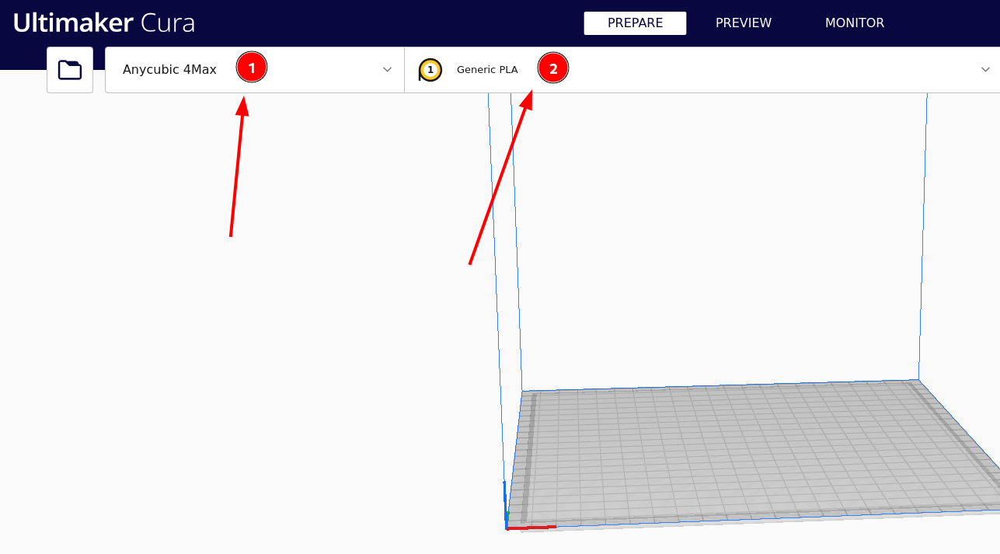
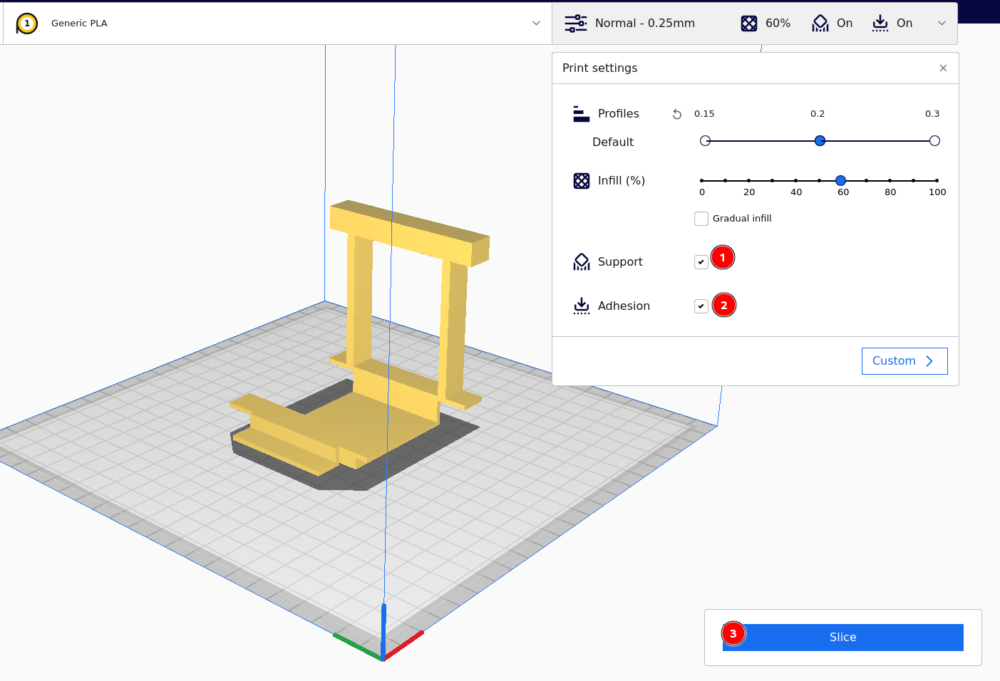
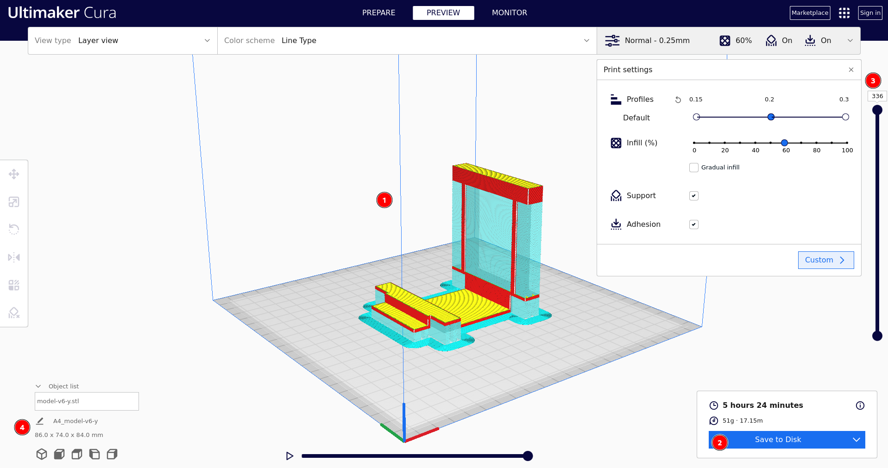

# Prepare 3D models manual

## Required software

* [Blender **v3.5.1** (or higher)](https://www.blender.org/download/)
* [Ultimaker Cura **v5.0.0** (or higher)](https://ultimaker.com/software/ultimaker-cura/)

## Required devices (and more)

* 3D printer (configured!)
* Generic PLA filament

## Setup

### Blender (for new projects)

#### Memory & Limits

For Bledner even selecting a face or a vertex is the step you can undo/ redo. When you start a new project it's great to setup some limits high enough.

1. Go to `Edit > Prefecences`
2. Choose `System` tab
3. In `Memory & Limits` change the *Undo Steps* to 2048 (or higher) and *Undo Memory Limit* to 8192 (or higher)

    **Tip**: Feel free to select any number - you are not forced to use 2 to the power of x values only

#### Units

Make sure you work with meters. Working on millimeters scale is very annoying :disappointed:

### Ultimaker Cura

1. Select printer (in my case it's Anycubic 4Max)
2. Select filament (I suggest using PLA)

## 3D preparing model tips

### New model

1. Start with one cube and do not add more objects

### Old model

1. Work on the copy of the model and increment version eg. `model-v2.blend` -> `model-v3.blend`

## Some 3D model requirements

1. No faces inside the model
2. Each face has **exactly** 4 verticies
3. No more than one vertex in each coordinates. If at least two verticies have the same coordinates merge them

## Exporting STL/ OBJ/ … model

In Blender:

1. `File > Export > (choose .stl/ .obj/ …)`
2. Export

    *Probably you don't even need to change model scale*

## Preparing .gcode for 3D printer

In Ultimaker Cura

1. `File > Open File(s)`
2. Choose your model
3. Change model properties
    * (1) support **required**
    * (2) adhesion *optional*

4. (3) Click `Slice`
5. Check:
    * (1) visually if model seems to be correct
    * (2) print time
    * (3) layers number
    * (4) model size after print

6. `Save to Disk` - choose disk you want save to
