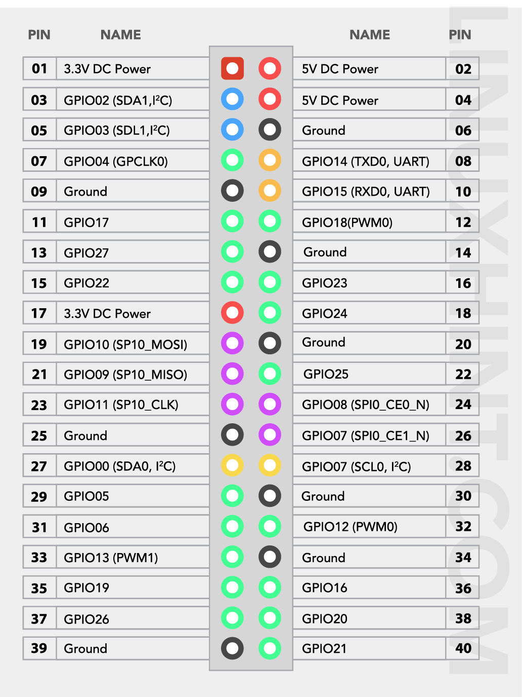

# RaspberryPi 4 - Miabot Pro communication module

## Requirements

### Parts

1. 8 wires (suggested to use 4 pairs in different colors)
2. RPi 4B with Ubuntu installed
3. Miabot Pro
4. At least 2 channels, bi-directional logic converter

## Setup RPi

### Enable GPIOs

Use `make install-gpio`. When raspi-config terminal appears enable (at least) UART and SPI

### Install pigpio library

Use `make install-pigpio` and check if it's installed correctly - use `make test-pigpio`.

### Install python dependencies

Use `make install-python-deps`

## Connect RPi to Miabot via the logic converter

* [*Miabot*] VCC and GND to logic converter VCC and GND
* [*RPi*] 3.3V DC Power (pin 01) to logic converter VL (or something named as lower V side on logic converter) and GND (pin 06) to GND
* [*Miabot*] PRG_MOSI to channel 01 on the logic converter
* [*RPi*] TX (pin 08) to channel 01 on logic converter
* [*Miabot*] PRG_MISO to channel 02 on logic converter
* [*RPi*] RX (pin 10) to channel 02 on logic converter

## Test if that works

1. **AFTER** connect every wire enable RPi and Miabot Pro
2. Place Miabot **SAFE** it's going to move his wheels so they cannot touch anything
3. Use `cd test` and `python3 test_send_data.py`
4. If everything is correct robot starts to move its wheels
